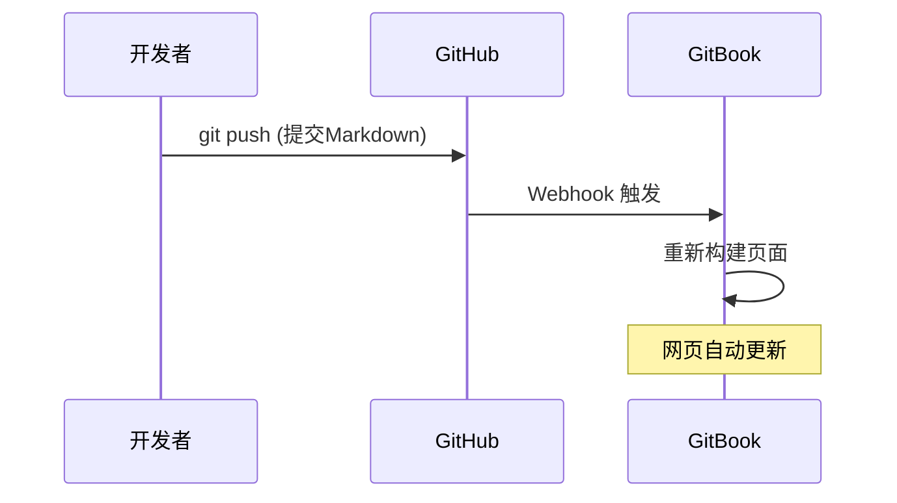
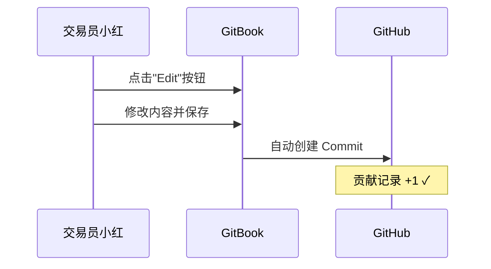

# 🏗️ 架构文档 | Architecture

> 本文档面向技术贡献者，解释项目的运作机制和设计哲学。

---

## 📐 系统架构概览

```
┌─────────────────────────────────────────────────────────────────┐
│                    SPX 0DTE GEX 手册架构                         │
├─────────────────────────────────────────────────────────────────┤
│                                                                 │
│   ┌─────────────┐         双向同步          ┌─────────────┐    │
│   │             │  ←───────────────────→   │             │    │
│   │   GitHub    │      Git Sync API        │   GitBook   │    │
│   │  (源码仓库)  │                          │  (可视化编辑) │    │
│   │             │                          │             │    │
│   └──────┬──────┘                          └──────┬──────┘    │
│          │                                        │            │
│          │ Markdown 文件                          │ 所见即所得  │
│          │                                        │            │
│          ▼                                        ▼            │
│   ┌─────────────┐                          ┌─────────────┐    │
│   │  程序员/     │                          │  交易员/     │    │
│   │  技术贡献者  │                          │  内容贡献者  │    │
│   └─────────────┘                          └─────────────┘    │
│                                                                 │
└─────────────────────────────────────────────────────────────────┘
```

---

## 🔄 双向同步机制

### GitHub → GitBook（代码驱动）



### GitBook → GitHub（编辑驱动）



**核心价值：** 交易员不需要学习 Git，就能成为 GitHub 贡献者！

---

## 📁 目录结构设计

我们采用**「实战场景式」**结构，而非传统的教科书式结构：

```
spx0dtegexguide/
│
├── 📄 README.md              # 项目门面，第一印象
├── 📄 ARCHITECTURE.md        # 本文档，技术说明
├── 📄 SUMMARY.md             # GitBook 目录配置
├── 📄 LICENSE                # MIT 开源协议
│
├── 📁 chapters/              # 核心章节
│   ├── 01-rubber-band.md     # 🔵 橡皮筋战术（正Gamma）
│   ├── 02-ice-surface.md     # 🔴 冰面竞速（负Gamma）
│   ├── 03-the-flip.md        # ⚡ 零号翻转（临界点）
│   └── 04-fakeouts.md        # 🎭 假动作识别
│
├── 📁 basics/                # 基础概念（给新手）
│   ├── what-is-gex.md        # GEX 是什么
│   ├── reading-gexbot.md     # 如何读 GexBot 数据
│   └── 0dte-basics.md        # 末日期权入门
│
├── 📁 appendix/              # 附录
│   ├── glossary.md           # 术语表
│   ├── faq.md                # 常见问题
│   └── resources.md          # 资源链接
│
└── 📁 .gitbook/              # GitBook 配置
    └── assets/               # 图片资源
```

### 为什么选择「实战场景式」？

| 教科书式 | 实战场景式 ✓ |
|---------|-------------|
| 第1章：什么是Gamma | 🔵 正Gamma环境怎么打 |
| 第2章：什么是GEX | 🔴 负Gamma环境怎么打 |
| 第3章：理论推导 | ⚡ 翻转点怎么识别 |

**理由：**
1. 日内交易员需要的是"看到信号→执行策略"，不是"学完理论→再实践"
2. 按市场状态分类，让用户能在交易时快速查阅
3. 基础概念放在 `basics/` 文件夹，需要时再查

---

## 🎨 内容命名规范

### 文件命名

- 使用小写字母和连字符：`01-rubber-band.md`
- 章节文件以数字开头便于排序
- 文件名应具备自解释性

### Commit Message 规范

```
feat: 新增橡皮筋战术章节
fix: 修正 GEX 计算公式错误
docs: 更新资源链接
style: 调整表格格式
```

### 分支策略

- `main`: 稳定版本，受保护
- `feature/*`: 新功能开发
- GitBook 直接编辑会自动创建 commit 到 `main`

---

## 🔧 GitBook 配置

### SUMMARY.md 结构

```markdown
# Summary

* [首页](README.md)

## 🎯 实战策略
* [橡皮筋战术](chapters/01-rubber-band.md)
* [冰面竞速](chapters/02-ice-surface.md)
* [零号翻转](chapters/03-the-flip.md)
* [假动作识别](chapters/04-fakeouts.md)

## 📖 基础概念
* [GEX 是什么](basics/what-is-gex.md)
* [读懂 GexBot](basics/reading-gexbot.md)

## 📎 附录
* [术语表](appendix/glossary.md)
* [FAQ](appendix/faq.md)
```

---

## 🚀 部署流程

### 首次设置

1. **创建 GitHub 仓库**
   ```bash
   git init
   git remote add origin https://github.com/bigeye-ai/spx0dtegexguide.git
   git push -u origin main
   ```

2. **连接 GitBook**
   - 登录 [GitBook](https://gitbook.com)
   - 创建新 Space
   - 选择 "GitHub" 作为同步源
   - 授权并选择本仓库
   - 启用 "Two-way sync"

3. **验证同步**
   - 在 GitBook 编辑一行
   - 检查 GitHub 是否有新 commit
   - 确认双向同步正常

### 日常维护

```
GitHub 编辑 ──push──→ GitBook 自动刷新
GitBook 编辑 ────────→ GitHub 自动 commit
```

---

## 🎯 设计哲学

### 「社区领袖」策略

本项目的核心目标是：**让不会编程的交易员也能成为 GitHub 贡献者**。

```
传统开源项目:
  [程序员] ──Pull Request──→ [仓库]

本项目:
  [交易员] ──GitBook编辑──→ [GitBook] ──自动同步──→ [GitHub]
                 ↓
           "我好像贡献代码了？"
```

### 核心原则

1. **零门槛参与**：不需要会 Git，不需要会 Markdown
2. **实战优先**：内容按交易场景组织，不按学术章节
3. **社区驱动**：鼓励每个人分享自己的交易笔记
4. **透明可追溯**：所有修改记录都在 GitHub 上

---

## 📞 技术支持

如果你在贡献过程中遇到技术问题：

1. 提交 [GitHub Issue](https://github.com/bigeye-ai/spx0dtegexguide/issues)
2. 描述你的操作步骤和遇到的问题
3. 附上截图（如果有）

---

<p align="center">
  <i>让技术服务于交易，让社区连接每一个人 🤝</i>
</p>
